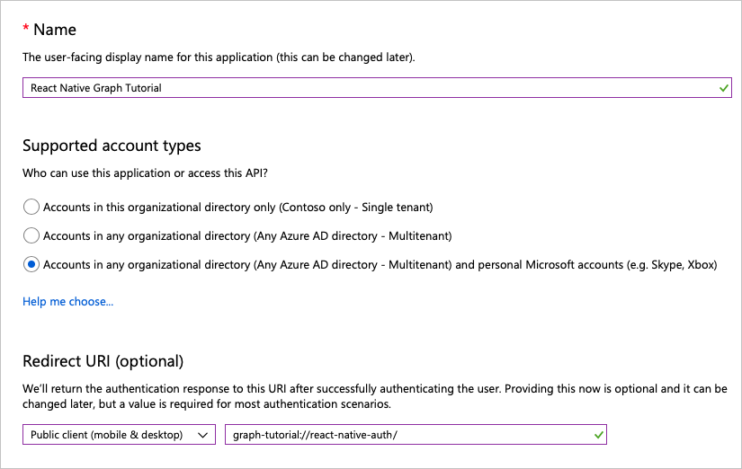

<!-- markdownlint-disable MD002 MD041 -->

En este ejercicio, creará una nueva aplicación nativa de Azure AD con el centro de administración de Azure Active Directory.In this exercise you will create a new Azure AD native application using the Azure Active Directory admin center.

1. Abra un explorador y vaya al [centro de administración de Azure Active Directory](https://aad.portal.azure.com) e inicie sesión con una **cuenta personal** (también conocida como: cuenta Microsoft) o una **cuenta profesional o educativa**.Open a browser and navigate to the [Azure Active Directory admin center](https://aad.portal.azure.com) and login using a **personal account** (aka: Microsoft Account) or **Work or School Account**.

1. Seleccione **Azure Active Directory** en el panel de navegación de la izquierda y, después, seleccione **registros de aplicaciones** en **administrar**.Select **Azure Active Directory** in the left-hand navigation, then select **App registrations** under **Manage**.

    

1. Seleccione **Nuevo registro**.Select **New registration**. En la página **Registrar una aplicación**, establezca los valores siguientes.On the **Register an application** page, set the values as follows.

    - Establezca **Nombre** como `React Native Graph Tutorial`.Set **Name** to `React Native Graph Tutorial`.
    - Establezca **Tipos de cuenta admitidos** en **Cuentas en cualquier directorio de organización y cuentas personales de Microsoft**.Set **Supported account types** to **Accounts in any organizational directory and personal Microsoft accounts**.
    - En **URI de redireccionamiento**, cambie la lista desplegable a **cliente público (móvil & escritorio)** y establezca `graph-tutorial://react-native-auth`el valor en.Under **Redirect URI**, change the dropdown to **Public client (mobile & desktop)**, and set the value to `graph-tutorial://react-native-auth`.

    

1. Seleccione **registrar**.Select **Register**. En la página de **tutorial de reAct de gráficos nativos** , copie el valor del identificador de la **aplicación (cliente)** y guárdelo, lo necesitará en el paso siguiente.On the **React Native Graph Tutorial** page, copy the value of the **Application (client) ID** and save it, you will need it in the next step.

    

1. En **administrar**, seleccione **autenticación**.Under **Manage**, select **Authentication**. En la página **URI de redireccionamiento** , agregue otro URI de redireccionamiento de tipo **cliente público (móvil & escritorio)**, con el URI `urn:ietf:wg:oauth:2.0:oob`.On the **Redirect URIs** page, add another redirect URI of type **Public client (mobile & desktop)**, with the URI `urn:ietf:wg:oauth:2.0:oob`. Haga clic en **Guardar**.Select **Save**.

    
